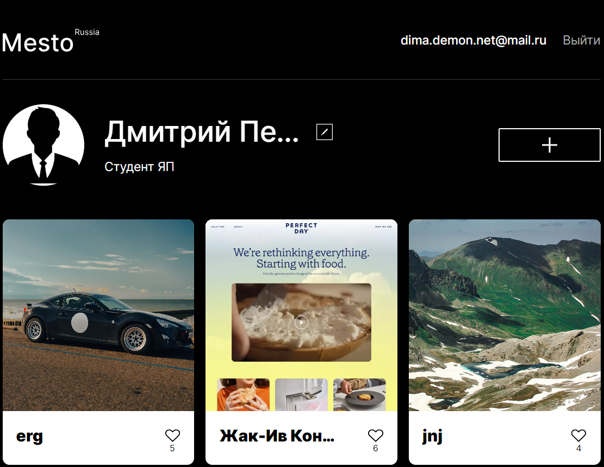

# Проект: Mesto (React) от _"Yandex Practicum"_.

Проект "Mesto (React)" - это веб-приложение для обмена фотографиями и путешествиями, разработанное с использованием React. Пользователи могут просматривать фотографии различных мест, добавлять свои собственные фотографии, ставить лайки и редактировать свой профиль. [Ссылка на gh-pages](https://dmitry145528.github.io/react-mesto-auth/#/) | [Ссылка на макет в Figma](https://www.figma.com/file/k0iQKIJBQ968sbh6OHQkjp/JavaScript.-Sprint-12?type=design&node-id=0-1&mode=design&t=OYGGdUpVfe3L2IdK-0)



## Структура проекта:

* [Mesto (версия Java Script)](https://github.com/Dmitry145528/mesto)
* Mesto (версия React) - этот репозиторий
* [Mesto (версия для сервера)](https://github.com/Dmitry145528/express-mesto-gha)
* [Mesto (версия с фронтендом и бэкендом)](https://github.com/Dmitry145528/react-mesto-api-full-gha)

## Что сделал:

* Создал компоненты интерфейса, такие как карточки с фотографиями, формы для ввода данных, профиль пользователя и другие. Применил Flexbox и Grid Layout для создания структуры страницы.

* Реализовал запросы к API, включая GET и POST запросы, а также другие необходимые для взаимодействия с сервером. Эти запросы позволили получать данные о фотографиях, загружать новые фотографии на сервер, а также обновлять информацию о профиле пользователя.

* Написал компонент для валидации данных, вводимых пользователями в различные формы. Это помогает предотвратить отправку некорректной или неполной информации на сервер.

* Применил JavaScript и CSS для добавления анимаций и эффектов при взаимодействии пользователя с интерфейсом, что делает его более интерактивным и привлекательным.

* Внедрил функциональность для сохранения некоторых данных на стороне клиента, что повышает производительность и удобство использования приложения.

## Реализованный функционал:

* Пользователи могут просматривать фотографии мест, загруженные другими пользователями.

* Пользователи могут выражать своё восхищение фотографиями, ставя лайки.

* Пользователи могут добавлять новые места, создавая собственные карточки, которые будут доступны для просмотра другим участникам. Также имеется возможность удалить собственную карточку, если она перестала быть актуальной.

* Пользователи могут просматривать фотографии в увеличенном режиме, открывая их в модальном окне.

* Каждый пользователь имеет возможность изменить свои данные, такие как имя, аватар и деятельность.

* Пользователи могут регистрироваться и авторизовываться.

* Реализовал попапы с информацией о статусе входа (успешный вход, ошибка).

## Технологии:

* Библиотека React для разработки пользовательского интерфейса.
* Хуки useState и useEffect для управления состоянием компонентов и выполнения побочных эффектов.
* CSS-фреймворк Flexbox для гибкой вёрстки.
* Технология @font-face для подключения шрифтов.
* CSS-фреймворк Grid-Layout для создания сложных сеток.
* Использование относительных единиц измерения, таких как vw, vh, %, rem и em для создания адаптивных интерфейсов.
* Использование псевдокласса :hover для интерактивных элементов.
* Формы и валидация данных средствами JavaScript.
* Позиционирование элементов.
* Методология БЭМ (Nested) для именования классов CSS.
* Адаптивная вёрстка с использованием медиазапросов @media screen.
* Обработка массивов данных с помощью методов JavaScript.
* Работа с данными по умолчанию.
* Модульная структура проекта с использованием import и export.
* Взаимодействие с API для получения данных о профиле и фотографиях.

## Инструкция по запуску:

1. **Склонировать репозиторий:**
   ```sh
   git clone git@github.com:Dmitry145528/react-mesto-auth.git
   git clone https://github.com/Dmitry145528/react-mesto-auth.git

2. **Перейдите в директорию проекта, выполнив команду:**

   `cd react-mesto-auth`

3. **Установите все необходимые зависимости проекта, выполнив команду:**

   `npm install`

4. **Перед запуском проекта в режиме разработки или деплоем на хостинг, необходимо собрать проект. Для этого выполните команду:**

    `npm run build`

5.  **Вы можете запустить проект в режиме разработки, выполнив команду:**

    `npm run dev`

6. **Если вы хотите разместить ваш проект на GitHub Pages, выполните следующую команду:**

    `npm run deploy`

## Статус разработки:

✅ _Завершено_

Дальнейшая разработка ведётся в репозитории [Mesto (версия для сервера)](https://github.com/Dmitry145528/express-mesto-gha)